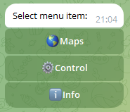
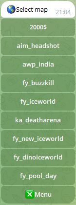
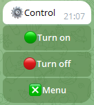

# Telegram Bot for control server in CS 1.6 (hosting: https://cp.gamehost.com.ua/)

# Table of contents
1. [Screenshots](#Screenshots)
2. [Tech Stack](#Stack)
3. [Features](#features)
4. [Run Locally](#run)
5. [Environment Variables](#environment)
6. [Feedback](#Feedback)
7. [License](#License)

## Screenshots

### Menu:

### Change map:

### Turn on/off:

## Tech Stack

**Client:** None

**Server:** Python

## Features

- Change maps
- Viewing server information
- Turn on/off the server

## Run Locally

Clone the project

~~~bash
git clone https://github.com/ka9mal6t/controler_server_cs_1_6.git
~~~

Go to the project directory

~~~bash
cd controler_server_cs_1_6
~~~

Install dependencies

~~~bash
pip install -r requirements.txt
~~~

Start the server

~~~bash
python main.py
~~~

## Environment Variables

To run this project, you will need to edit the following environment variables to your config.py file

`ID_SERVER`

`API_KEY`

`ALLOWED_USERS`

`TOKEN`

## Feedback

If you have any feedback, please reach out to us at vladimyr.kilko@gmail.com

## License

[MIT](LICENSE)

